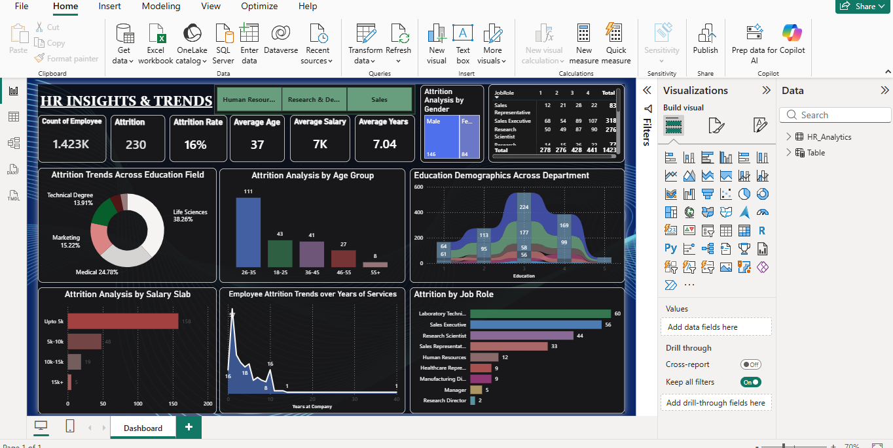

# 📊 HR Analytics Dashboard — Power BI

An interactive HR Analytics dashboard built using Microsoft Power BI to analyze employee demographics, attrition, salary, job roles, education, and years of service.

## 📌 Dashboard Preview

## 🎯 Project Objective

The objective of this project is to transform HR data into meaningful visual insights that can help understand employee attrition and workforce trends.

## 📈 Key KPIs

- 👥 Total Employees: 1.423K
- 🚪 Attrition: 230
- 📉 Attrition Rate: 16%
- 🎂 Average Age: 37
- 💰 Average Salary: 7K
- 🏢 Average Years of Service: 7.04

## 🔍 Dashboard Analysis

The dashboard provides insights into:

- Employee attrition across different education fields
- Attrition by age group
- Education demographics across departments
- Attrition across different salary slabs
- Employee attrition based on years of service
- Attrition by job role
- Attrition analysis by gender
- Job role-wise employee distribution

## 🛠️ Tools & Technologies

- Microsoft Power BI
- Power Query
- DAX
- Data Cleaning & Transformation
- Data Visualization
- Data Analysis

## 📂 Project Files

| File | Description |
|---|---|
| `HR Analytics.pbix` | Power BI dashboard and data model |
| `HR-Analytics-Dashboard.png` | Dashboard preview |

## 💡 Key Takeaways

The dashboard helps identify patterns in employee attrition based on factors such as age, salary, education, job role, gender, and years of service.

## 👨‍💻 Author

**Lovish Jain**

This project was created as part of my data analytics portfolio.
